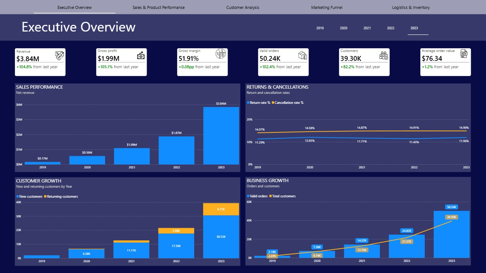
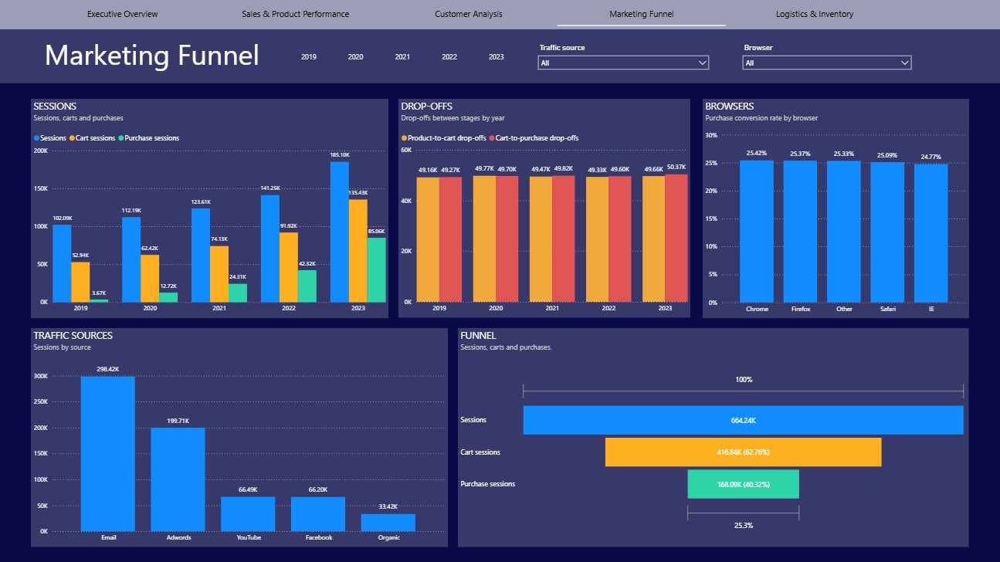
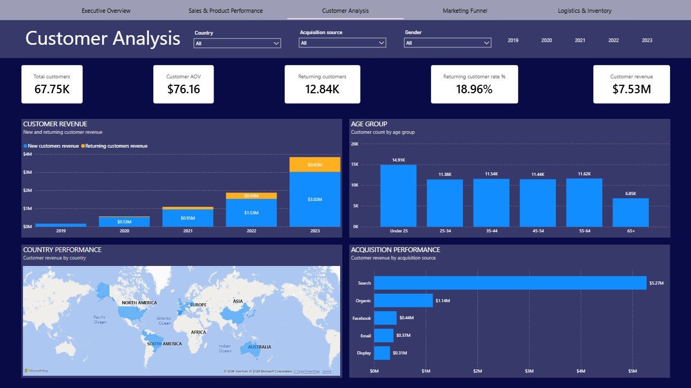
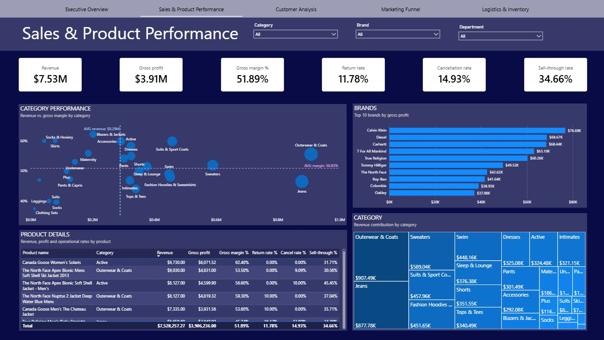
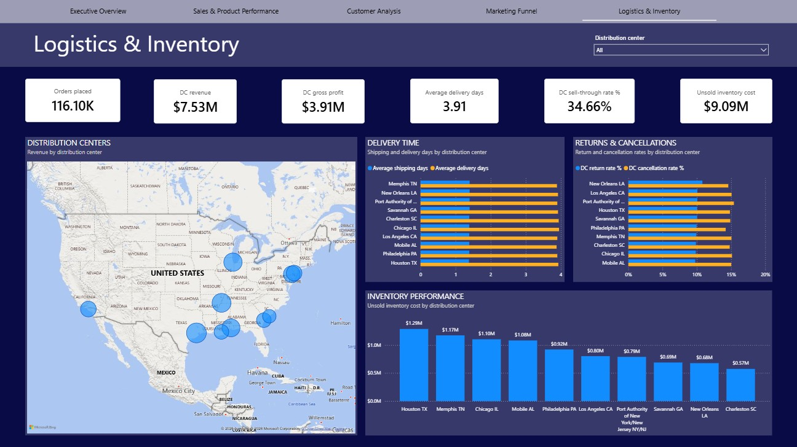

# TheLook E-Commerce — SQL Server + Power BI

**Where is a fast-growing online retailer actually losing money, and is the growth worth anything?**

Five-page Power BI report on a layered SQL Server warehouse. Data is [TheLook eCommerce](https://console.cloud.google.com/marketplace/product/bigquery-public-data/thelook-ecommerce), a synthetic clothing retailer published by Google — seven source tables, 116K orders, 664K web sessions, January 2019 to December 2023.

**Stack:** SQL Server (T-SQL) · SSMS · Power BI Desktop · Power Query (M) · DAX · 63 measures

---

## Key findings



**Growth is volume, not performance.** $7.53M revenue over five years at a 51.89% margin — but the margin has barely moved across those years, and 2023's 105% revenue growth came with a 1.2% change in average order value. The business is getting bigger without getting better at selling, so every incremental dollar of revenue costs roughly what the last one did.



**249K sessions added something to a cart and left.** 664K sessions, 63% reach a cart, 25% buy. Drop-offs have stayed flat at 45–50K a year while sessions nearly doubled — the rate improved sharply, the volume of lost sessions didn't. This is the cheapest loss to attack, because that traffic is already on the site and already intent-qualified.



**Only 19% of customers ever return, and Search drives more revenue than the other four channels combined.** Growth bought through a single channel, with no repeat-purchase base to absorb a shock to that channel's economics. Nothing in the demographics offers an alternative lever — customer counts are broadly similar across age bands and conversion sits at roughly 25% on every browser.



**Jeans is the clearest pricing target.** Outerwear & Coats ($907K) and Jeans ($878K) sit at near-identical revenue, but Outerwear is above the 50.83% average margin line and Jeans below it. Same volume, different quality of revenue.



**$9.09M of inventory cost is unsold** at 34.66% sell-through, concentrated in the largest centers. The ten distribution centers are otherwise near-identical on delivery time and return rate, so there's no logistics outlier to chase — effort belongs on the funnel and the catalogue.

---

## How it's built

```
CSV → src (raw, never modified) 
    → cleaned (trim, NULLIF, quality flags)
    → analytics (3 dimensions, 4 facts) 
    → reporting (7 views)
    → Power BI (63 measures)
```

Business logic — cutoffs, status exclusions, rate components — is defined once in SQL. DAX only handles what has to respond to the user's filters. Chapters `1`–`4` validate, `5`–`6` build, `7_1`–`7_5` explore by domain, `8` delivers the views Power BI reads.

---

## What the validation caught

**35,872 order items have impossible date sequences.** Order-level dates drive fulfilment metrics instead; the rows are flagged rather than deleted. Within the analysis window they hold $1.99M — 19.8% of item revenue — so dropping them would have understated every headline figure by roughly a fifth, with nothing to signal it.

**Three order counts appear in this report and none are interchangeable.** 116,096 orders exist (`Total orders`); 98,847 are non-cancelled (`Valid orders`); the Logistics page counts 160,816 order-by-distribution-center assignments, because only 72% of orders ship from a single center. The non-cancelled figure was originally named `Total orders` — which is how the cancellation rate ended up dividing by non-cancelled orders and reading 17.5% instead of 14.9%. The fix was naming, not arithmetic.

**24 products have no brand, and the original check reported zero.** It tested `TRIM(brand) = ''`, which evaluates to UNKNOWN against NULL rather than TRUE. They're labelled `Unknown brand` rather than dropped, keeping their revenue in the category totals.

---

## Limitations

- **The Product and Logistics pages can't be filtered by year.** Both views combine period measures (revenue, returns) with point-in-time inventory measures (sell-through, unsold stock). Adding a year grain would split revenue correctly but duplicate the inventory figures across every year, so the real fix is to separate flow from stock into two views rather than add a column.
- **Customer metrics are year-grain only**; anything below Year is meaningless.
- **`Total customers` counts purchasers, not registered users.**
- **Session traffic sources and customer acquisition sources use different vocabularies**, so the funnel and acquisition analyses can't be joined channel-to-channel.
- **The dataset is synthetic.** A 63% session-to-cart rate is roughly ten times what real retail sees — the method transfers, the values don't.

---

## Recommendations

The dataset is synthetic, so the magnitudes are not real-retail benchmarks. The relative comparisons hold, because both sides of each come from the same source.

- **Test cart recovery before buying more traffic.** 249K sessions reached a cart and left — the largest single loss in the funnel, and already paid for.
- **Reduce the Search dependency.** It drives $5.27M of customer revenue against $2.26M from the other four channels combined, with only a 19% repeat rate to absorb a shift in that channel.
- **Review Jeans on price or cost.** Equal revenue to Outerwear, below-average margin — the clearest single margin opportunity in the catalogue.
- **Clear the 180-day inventory tier.** The aging analysis in chapter 7.5 already isolates it and names the slowest-moving products.

---

## Running it

1. Download the seven TheLook CSVs from the
   [BigQuery public dataset](https://console.cloud.google.com/marketplace/product/bigquery-public-data/thelook-ecommerce)
   — `users`, `products`, `orders`, `order_items`, `inventory_items`,
   `distribution_centers`, `events`.
2. Run `SQL/1` to create the schemas, then import the CSVs into `src`
   using the SSMS Import Wizard.
3. Run `SQL/2` through `SQL/8` in order.
4. Open the `.pbix`, set the `ServerName` and `DatabaseName` parameters, refresh.
5. 
